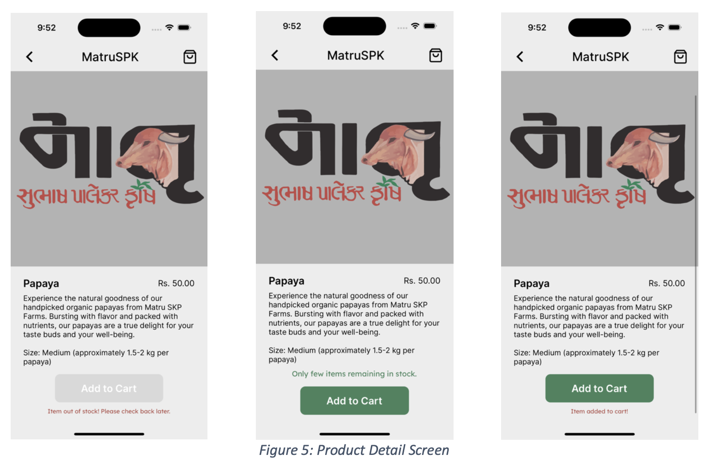

<h1>MatruSPK</h1>

<h3>NOTE: The hosted server is currently shut down.</h3>

<h2>Introduction</h2>

There is a farm in the city of Surat in Gujarat, India, where they grow organic produce in a specific way practicing the farming method, Subhash Palekar Krishi (SPK), that promotes a natural way of farming by keeping the ecosystem of the soil alive. The farming style has changed names over the years and currently called Subhash Palekar Krishi, named after Subhash Palekar, who proposed the method. This method of farming is very beneficial for the farmers, as it cuts down the cost of investment, increases the yield, grows organic produce, increases the quality of produce, and keeps the soil healthy.

The owner of the farms is an engineer, who has his own businesses and is a promoter of the farming method. The owner of the farms is planning to sell some types of produce and organic products, which they manufacture themselves, at a scale. Currently the farms are operated at a very small scale but are planning to increase the size of their operation and do deliveries throughout the city, sub- urban areas, and some neighboring rural areas. They are also planning to transition to the digital space, and to accommodate their needs this project is proposed.

The project is an e-commerce mobile application for Matru SKP Farms, supported for use on iPhones and Android phones. The farms are located in Gujarat, India, so the app is targeted to be used by the people within the delivery range of the farm. The application will allow the users to browse through the products that are available for sale. The users can add, update, or remove items from the bag. When the user is ready to make an order, the user can checkout and will be directed to a form screen for delivery address. Once the required fields are filled with valid responses, the app will check whether the farm delivers in the user’s area. If not, the user will be informed, but if they do deliver in the user’s area, the user will be asked to make a payment by either credit or debit card. If the payment is successful, the order will be placed. The user can also track the status of their order through the app and can see their order history.

The app will have three different views depending on the type of user. One user type will be the customers that are using the app to browse through the products and/or make purchases. The second type of user will be the staff, who can view the orders, update the status of an order, and can manage the inventory of products by updating the quantity available for a product. The third type of user will be admin user. The admin can control which product and category of products to display for the customers. The admin can view, add, update, and delete the categories and products. The admin can also manage the list of valid deliverable zip codes and additional charges: taxes and delivery fee. Additionally, the admin can get the payment records stored in the database (DB). Any changes made in the admin/staff portal(s) will be in affect in real-time.

To realize this project, a comprehensive technology stack has been employed. This includes the utilization of React Native Expo for mobile app development, Amazon Web Services (AWS) for backend components deployment, MariaDB, a relational database for data storage, and Stripe for secure payment processing. Additionally, the project employs authentication and authorization mechanisms through JSON Web Tokens (JWT) for user access control and passwords are securely hashed and stored using bcrypt for enhanced security.

The subsequent sections provides more information about project's methodology, user requirements, system design, implementation, conclusion, and future implementations.

<h2>Methodology</h2>

<h3>1. Requirements Gathering</h3>
   The first phase of the project involved extensive requirements gathering. This step included meetings and discussions with the owner of Matru SKP Farms to understand their current business process and their future operations expectations and needs. The gathered requirements were documented to create a comprehensive project scope and plan.

<h3>2. Technology Selection</h3>
   The second phase of the project involved selection of technologies and frameworks. The following technologies were chosen:
      • React Native Expo: A CPF for the development of iOS and Android mobile applications using a single code base. Expo provides a large set of pre-built components and Application Programming Interface (API). Also, Expo allows for easy development, deployment, and sharing of the application without the knowledge of plaborm-specific code.
      • Express JS: A Node JS web application framework to build the RESTful APIs for the backend of the application.
      • MariaDB: An open-source relational DB to store structured data.
      • AWS: A could-based service to deploy the backend components:
         o AWS EC2 Instance to deploy the node server application.
         o AWS RDS was utilized to host the MariaDB.
         o AWS S3 was utilized to store image files for products.
      • JWT: A token-based mechanism for secure user authentication and authorization.
      • Stripe: A secures payment gateway for secure and reliable payment processing.
      • Bcrypt: A library for password hashing and securely storing user passwords.

<h3>3. Database Schema Design</h3>
   The third phase of the project involved the design of database schema to accommodate the data requirements for the application. This included user profiles, product catalogs, carts, orders, payment records, tax and delivery rates, and deliverable zip codes. Additionally, the relationships between tables were established to maintain data integrity.

<h3>4. API and UI/UX Design</h3>
   The fourth phase of the project involved the design of RESTful APIs to accommodate the communications between the mobile application and the server application. Concurrently, the user experience (UX) and user interface (UI) were designed for the application. This involved wireframing, and iterative design to ensure a user-friendly and visually appealing app.

<h3>5. Development</h3>
   The fifth phase of the project involved the development of the application using react native expo, database using scripts, and server using Express and Node JS.

<h3>6. Testing and Debugging</h3>
   The sixth phase of the project involved the testing and debugging phase the application.

<h3>7. Deployment</h3>
   The seventh phase of the project involved the deployment of backend components on AWS. The application is not listed on the app store and play store because it is not yet presented and approved by the owner of the farms.

<h2>User Requirements</h2> 

The user requirements collected in the data gathering phase of the project are following:
   1. The user interface should be a mobile application for iOS and Android plaborm.
   2. The user interface should allow a user to register an account.
   3. The user interface should allow a registered user to sign in.
   4. The user interface should allow registered users to update their personal information.
   5. The user interface should allow user to change their password.
   6. The user interface should display the products according to the category. 
   7. The user interface should display the products for users to buy.
   8. The user interface should display the description and price of a product. 
   9. The user interface should allow the user to search for a specific product by name or description.
   10. The user should be able to add desired items into the cart.
   11. The user should be able to edit the quantity of an item in the cart.
   12. The user should be able to remove an item from the cart.
   13. The user should be able to view their cart.
   14. The user should be able to see the total price of the cart along with a price breakdown.
   15. The user should be able to check if their shipping address is valid and in the delivery range.
   16. The registered user should be able to place an order, if the delivery location is valid and in range.
   17. The registered user should be able to pay for the order using a card. 
   18. The registered user should be able to see the status of an order.
   19. The signed-in user should be able to sign out of the application.
   20. The registered user should be able to delete their registered account. 
   21. Admin should be able to add, update, hide/unhide a product.
   22. Admin should be able to add, update, or delete a category of products. 
   23. Admin should be able to add or remove a staff account.
   24. Admin should be able to see payment records.
   25. Admin should be able to control the tax and delivery rates.
   26. Admin should be able to add or remove a deliverable zip code.
   27. Staff user should be able to retrieve order information.
   28. Staff user should be able to update order status.
   29. Staff user should be able to update the quantity available for a product.

<h2>System Design</h2>

The collected user requirements, and the literature review helped with the designing of the system.

The first user requirement was that the user interface should be an application which will be supported on iOS and Android mobile phones. Since this project is at a small scale and it requires the application to run on multiple plaborms, a cross- plaborm framework was used. React Native Expo was chosen to build the application as expo builds the app on their cloud, so it is helpful and provides convenience in the development and testing phases.
The next two user requirement (2, and 3) were that the application should allow a user to register a new account and a registered user can login using their account credentials. To fulfill these requirements, React Native Expo was used along with MariaDB as the DB. JWT was used to generate access and refresh tokens for a user that are sent as a response from the server, when a user registers or logs in. bcrypt library was also used. When a user registers their account, the server will hash the user passwords using bcrypt and save the hashed passwords in the DB to add security. When a user logs in, the server will then try to verify that the submiqed password matches with the hashed password stored in the DB, using bcrypt and respond accordingly.

Requirements 4 and 5 just need the React Native Expo, JWT and MariaDB as it just updates the user information. Requirement 6 uses React Native Expo and MariaDB as it just retrieves information from the DB because the categories are meant for public access, so JWT is not required.

Requirements 7 - 10 uses React Native Expo, JWT, MariaDB, and AWS S3 bucket. AWS S3 is used because the images of the products are stored in the S3 bucket, and the images are displayed with the product information.

Requirements 11 - 16 just uses React Native Expo, JWT, and MariaDB. Requirements 17 uses React Native Expo, JWT, MariaDB, and Stripe, as payments are processed using Stripe. Requirement 18 - 21 again just uses React Native Expo, JWT, and MariaDB as they just view, add, update, or remove records from the DB.

Requirement 22 uses React Native Expo, JWT, MariaDB, and AWS S3 as Product images are again used to view or update the product. The rest of the requirements 23-29 just uses React Native Expo, JWT, and MariaDB as they just view, add, update, or remove records from the DB.

<h2>Implementation</h2>

The application has three different views: 1. customer, 2. Staff, and 3. Admin. 

The components for the customer user include:
   1. Authentication (which is common for all types of users). 
   2. Product browsing.
   3. Product filter by category.
   4. Product search.
   5. Cart (management). 
   6. Checkout.
   7. Order history.
   8. User info update.

The components for staff user include:
   1. View orders.
   2. Update order status. 
   3. Mange inventory.

The components for the admin user include:
   1. Manage product categories.
   2. Manage products.
   3. Manage staff accounts.
   4. View payments.
   5. Manage deliverable zip codes list. 
   6. Manage tax and delivery rates.

Figure 1. shows the use case diagram for the application based on the user requirements. The diagrams show what type of users are authorized to do what.

In the DB, the user table stores user information, user credentials, and they type of user. There are two flag columns (is_staff, is_admin) in the user table, indicating whether the user is a customer, staff member, or an admin. The values for is_admin and is_staff columns for a user can both be 0=false, but it cannot be 1=true. This helps with distinguishing the type of a user.

A user will only see or can only navigate of a screen if they are authorized to access the screen. To do this, different navigation stacks are created and based on the type of the user the stacks will be activated.

Any user regardless of their type initially lands at the login screen and from that screen the user can navigate to the register account screen. Figure 2 shows the screen images. The register account screen can be accesses by an admin, staff, or customer, but its only applicable to the customers. Log in and register account screens are contained in a navigation stack intended just for authentication.

When a customer tries to register a new account on the app, the user must provide the required field values, only when the values are provided, the user can click the submit buqon. When the user submits the request, the server will validate the information, and if the information is not valid, send an appropriate response message to display to the user. If the information is valid, a new record will be added to the user table in DB with appropriate information. Additionally, a cart will be created for the user. As a response, the server will send a JSON object containing the access token, refresh token, access token expiration, refresh token expiration, the user cart id, and the user info (first name, last name, email).

When a user tries to log in to the app using their credentials, the server will verify the identity of the user and sends a JSON object just like the response for register account request.

The app has a context which will store the user information that is sent as a response aEer successful login or registration. Information stored in the context can be used throughout the app so the user information such as the access token, and user email will be used to make API calls to the server. The context will also store the user information in storage, so that the user does not need to log in to their account aEer each time they close the app and reopen it. The context of the app will also distinguish the type of the user and based on the type; the appropriate navigation stack will be activated.

Access tokens are used for authentication and authorization. When a request is sent to an API endpoint which is protected, a middleware will verify the user’s identity using the access token, which will be sent in the request header. If the user is authenticated, the middleware will see if the user has permission of access the endpoint using the is_staff and is_admin flag. Access tokens are supposed to be short lived to increase security, so we have refresh tokens to refresh the access token. When an access token expires, the app will see if the refresh token is also expired. If so, the user will be logged out, if not the app will send a request to the server requesting a new access token.

Figure 3 shows the landing pages for each type of users aEer successful login. Different navigation stacks are created for different types of users to restrict the operations based on the type of user.

A user can filter the list of products by the category or can even search for a product. When a user searches a product, the product will be aqempted to be fetched by matching the search query with the product name or product description. Figure 4 shows the screen for such operations.

When a user clicks on a product, the product information will be displayed and if the product is out of stock, a message will be displayed. If the product quantity is low, a message will be displayed saying only few items are remaining in stock. The user can add an item in the cart by navigating to the product detail screen and pressing the add to cart buqon. When a product is successfully added to the cart or an error occurs, a message will be displayed to the user for 3 seconds and then disappear. Figure 5 shows how the product details screen looks like. If the user is trying to add to the cart already exists in the cart, it will increment the quantity of the product in cart.

Figure 6 show the screen for the cart. The user can increment the quantity of an item in cart, decrement the quantity of an item in cart, can delete an item in cart, or even clear the whole cart. If or when a cart is empty, the screen will display a message and ask the user to start shopping. The quantity available of a product is only updated when an admin or staff updates it, or when a successful purchase is made. The cart management is validated for every possibility. If a user wants to add or update the quantity of an item in the cart, it will check if the product is available in the desired quantity. If a user has already added an item in the cart and if the item is sold out before the user decides to checkout, or if the admin hides the product, or if they quantity available for the product is now less than the quantity of the item in cart, the whole cart will be updated and validated when the user checkout, and appropriate messages will be dislpayed. A specific cart item will also be updated and validated when an operation is performed on that item.

If the product is not available in the desired quantity, the quantity of the cart item will be updated to the max available quantity of the product.

The total price of the cart and respective charges are calculated and displayed on the cart screen. The rates for delivery and tax are stored in the DB. Based on the rates the prices are calculated.

Figure 7 shows the checkout screen. The checkout screen will contain a form for the delivery address. If a user has already added an address to the profile, the checkout screen will retrieve the address associated with the user, if not, a blank form will be displayed. The user can edit the form inputs. The form is also validated, and when all the required fields are filled, the user can continue. When the user continues the app will check if the address provided by the user, is a deliverable address. In other words, if the farm delivers in the area. This will be done by seeing if the zip code provided by the user exists in the deliverable zip code table in the DB. If the farm does not deliver in the area, the user will be displayed a message for 5 seconds, but it they do deliver in the area, the user will be directed to the payment screen. Figure 8 shows this validation.

The stripe payment will be shown in test mode. This is because the stripe payment gateway has not been updated to be in production mode. However, the stripe test mode provides some payment methods for specific cases. Figure 9 shows images of the payment gateway when provided with a payment method that is meant to fail and an image when the payment is successful. When a payment is successful, the order will be created and saved in the DB, and the user will be redirected to a different screen displaying a successfully order placed message. When the user closes the message, the user is redirected to the home screen and the navigation state is reset.

The order history screen will display all the purchases made by the user, and if there are no purchases, a message will be shown. Figure 10 shows the order screen when no there are no purchases made by the user and when there is.

The user can see the order details for each order and the status of the order. There are three types of order status. The order status will be defaulted as “Ordered” when a successful order has been placed. The staff member can update the status of an order. The other valid order statuses are “On the way” and “Delivered”.

The customer user has some additional operations they can perform. Figure 11 show this list of the options. The user can edit their profile, where they can update their first name, last name, and/or phone number. The user can update their email address. When an email is updated in the user table in DB, email values for all the other tables that references the email of user table gets updated as well. The user can also update their password, and to do that the user will have to provide the current password and a new strong password. The user can also add/update their address, and if the user is unsure if the farm delivers in their area, the user can check it with their zip code. The user can also delete their account from the app. Figure 12 & 13 shows screens for each of these operations.

These are all the screens the customer user can navigate to.

The DB for the project has 10 tables in total. Figure 14 shows the schema of the DB designed for the project. The DB is quite straight forward. There is a user table to store user information, there is a category table to store the categories of products. There is a product table to store the information about the product. The product table has several columns. The column image_url stores the URL of the images that are stored in the AWS S3 bucket. The images are made public on the bucket. The file _key column stores the name of the file that is stored in the S3 bucket. The files are saved such that the file name is the name of the product + the image extension. The cart and order table contains each cart and order, while the cart item table and the order item table contain all the items associated with a cart and an order for all the carts and orders. When a successful order is placed, the cart item is moved to order item table and the cart is cleared. The payment table does not store any payment details of an order, it just stores the order id of the order for which the payment was made, the payment method, the amount paid and the date and time of the payment. The deliverable zip code table stores a list of all the zip codes that the farm delivers to. The additional charges table have two columns and two records: 1. Delivery fees, and 2. Tax rate.

The staff user and admin user only manage the DB. Figure 15 shows all the screens the staff navigation has. The staff user can get the orders by the status of the orders. The staff member can then click on an order to get more information about the order. The staff member can also update the status of a particular order. Finally, the staff user can see the list of all the products with the product id, name of the product, and the quantity currently available of the product. With this information the staff can update the quantity available of a product according to their inventory.

The admin user has some more privileges than the staff user. Figure 3 shows the landing screen for an admin user and all the operations the admin can perform. Figure 16 shows the screens for managing the staff accounts, deliverable zip codes, additional charges, and viewing the payment records. The admin can get the list of all the staff accounts, add a new staff account, and remove an existing staff account. The admin can add and/or remove a deliverable zip code. The admin can change the rate of charges. The rates are stored as integers in the DB but when the prices are calculated, the rate of delivery is a fixed rate, and the tax rate is applied to the subtotal. The admin can also get all the payment records or a specific payment record by inputing the order id.

Figure 17 shows the admin screens for managing the categories. To manage the categories, the admin can see all the categories currently present in the DB. The admin can add a new category, update an existing category, or delete a category from the DB. When the admin tries to delete a category, the server will verify if the category can be deleted or not. A category cannot be deleted if there are any products assigned to that category. If this happens, the admin will be notified, and the admin would have to change the category assignment of all the products that are currently assigned to the category that needs to be deleted.

Figure 18 shows the screens for managing the products. Similar to the category management, the admin will be shown a list of products. The admin can click on a product to update it. The admin can also add a new product. When adding or updating an image of the product, the admin can select a single image from the photo library and use it. When the admin clicks on a product the app fetches the current information about the product and put it in the input fields. This allows the admin to change a specific thing about the product and not having to fill all the rest of the information. If the admin wants to update the product image, the app will show the current image of the product and the new image selected for the product.

<h2>Conclusion</h2>

The project was to design and build an e-commerce mobile application for iOS and Android devices. The e-commerce app was built for a farm in India, that is transitioning into the digital space and expanding their operations. The project involved gathering data and collecting the user requirements for the project, doing literature review, selecting the technologies for the project, designing the system, and developing the application. The application was then tested, and the test results were documented. The application was successfully designed and built to meet the user requirements and solve their problem.

<h2>Future Implementations</h2>
The project has a lot of room for improvement. This project has laid out a strong foundation and accommodated all the major requirements that were needed to get things moving. However, the app can still be expanded. Currently, a product on the app only has a single image to display. Feature to add more images of a product can be incorporated. The size of a product is currently fixed, and a feature can be incorporated which allows a user to select a preferable size from a predefined size options. A Wishlist can also be added to the app and the UI/UX of the app can be updated to make it more appealing to the customers. These are just a few new features that can be added to the app. Additionally, through testing and quality assurance can be performed on the application.